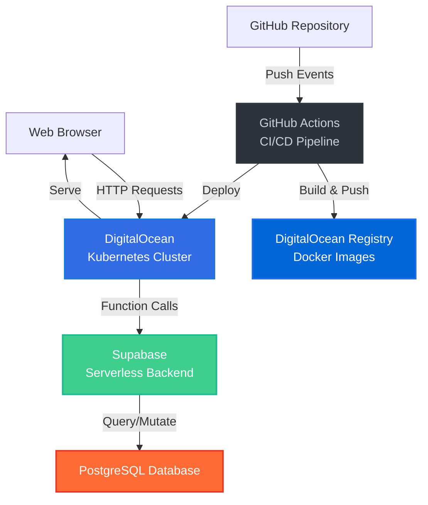
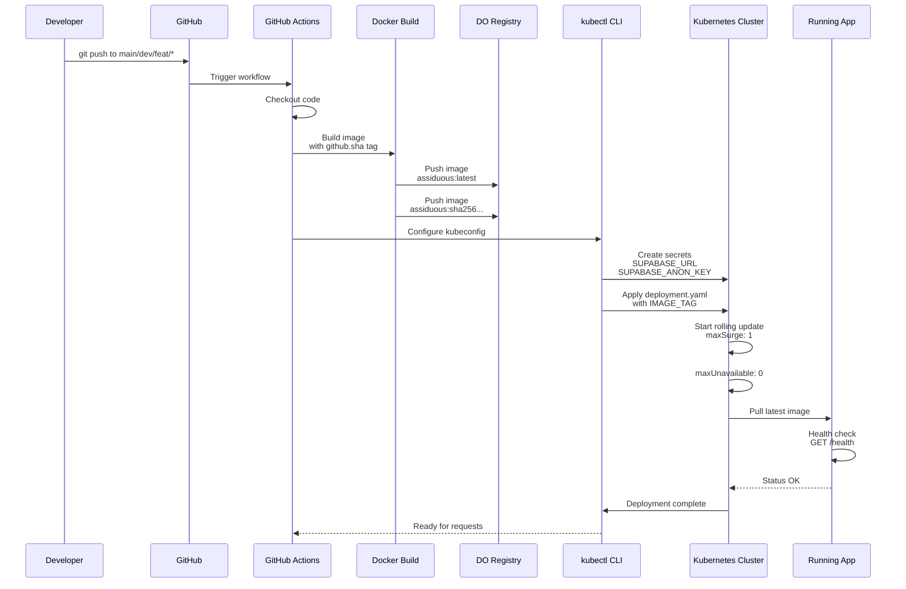
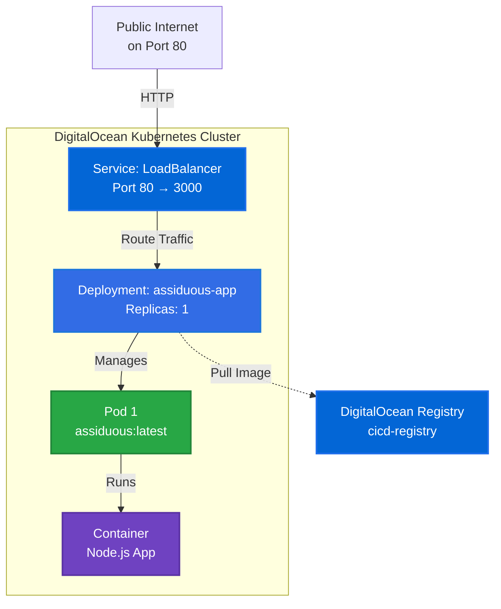

# Assiduous - Cloud-Native Study Tracker

A modern, cloud-native study session tracker built with serverless architecture and containerized deployment. Assiduous enables students and professionals to track their study sessions, manage learning goals, and compete on leaderboards—all with enterprise-grade infrastructure.

## Overview

Assiduous is designed as a scalable, event-driven study tracking platform that leverages serverless edge functions for business logic and Kubernetes for reliable, scalable deployment. The application manages study sessions, goals, statistics, and maintains a competitive leaderboard across multiple subjects.

### Core Capabilities

- **Study Session Tracking**: Create, manage, and analyze study sessions with automatic time tracking
- **Goal Management**: Set weekly study goals per subject and track progress
- **Statistics Dashboard**: View comprehensive study analytics and performance metrics
- **Subject Leaderboards**: Competitive rankings across different subjects
- **Real-time API**: RESTful API with health checks and metrics endpoints
- **Serverless Edge Functions**: Business logic powered by Supabase Edge Functions

---

## Architecture

### High-Level System Architecture



---

## CI/CD Pipeline

The continuous integration and deployment pipeline is fully automated using GitHub Actions, Docker, and Kubernetes. Every push to the main branch, dev branch, or feature branches triggers an automated deployment pipeline.

### Pipeline Workflow

```mermaid
graph LR
    A["Code Push<br/>to GitHub"] -->|Trigger| B["GitHub Actions<br/>CI/CD Job"]
    B -->|Checkout Code| C["Code Validation"]
    C -->|Build Docker<br/>Image| D["Docker Build"]
    D -->|Authenticate| E["DigitalOcean<br/>Registry Login"]
    E -->|Push Images| F["Docker Registry<br/>cicd-registry"]
    F -->|Pull Image| G["Kubernetes<br/>Deployment"]
    G -->|Rolling<br/>Update| H["Service<br/>Running"]
    H -->|Health Check| I["Verify<br/>Status"]

    style A fill:#ffb703,stroke:#fb8500,stroke-width:2px,color:#000
    style B fill:#2d333b,stroke:#30363d,stroke-width:2px,color:#c9d1d9
    style D fill:#005f87,stroke:#033c8d,stroke-width:2px,color:#79c0ff
    style E fill:#0366d6,stroke:#1f6feb,stroke-width:2px,color:#fff
    style F fill:#0366d6,stroke:#1f6feb,stroke-width:2px,color:#fff
    style G fill:#326ce5,stroke:#1d76db,stroke-width:2px,color:#fff
    style H fill:#28a745,stroke:#22863a,stroke-width:2px,color:#fff
    style I fill:#6f42c1,stroke:#5a32a3,stroke-width:2px,color:#fff
```



### Deployment Pipeline Details



### Pipeline Stages

#### 1. Code Validation & Checkout
- Repository code is fetched with full history
- All source files including Kubernetes manifests are available

#### 2. Authentication
- DigitalOcean container registry credentials are configured
- Security: Credentials are stored as GitHub Secrets (DO_TOKEN, SUPABASE_URL, SUPABASE_ANON_KEY)

#### 3. Build & Push Docker Image
```dockerfile
FROM node:18-alpine
WORKDIR /app
RUN apk add --no-cache ca-certificates
COPY package*.json ./
RUN npm install --omit=dev
COPY . .
USER node
EXPOSE 3000
HEALTHCHECK --interval=30s --timeout=5s --start-period=10s --retries=3
CMD ["node", "server.js"]
```

Each build is tagged with:
- **Commit SHA**: Unique identifier for traceability (e.g., `assiduous:abc123def`)
- **Latest tag**: Always points to the most recent build

#### 4. Kubernetes Deployment
- Rolling update strategy ensures zero downtime
- Old pods are terminated only after new pods pass health checks
- Configuration: Max 1 surge pod, 0 unavailable pods

#### 5. Health Verification
- Readiness probes: Verify pod is ready for traffic (5s initial, 10s interval)
- Liveness probes: Detect and recover from stuck processes (15s initial, 30s interval)
- Rollout status: Waits up to 180 seconds for deployment to complete

---

## Deployment Architecture

### Kubernetes Deployment Configuration



### Resource Allocation

- **CPU Requests**: 100m per container
- **CPU Limits**: 250m per container
- **Memory Requests**: 128Mi per container
- **Memory Limits**: 256Mi per container

These conservative limits ensure efficient cluster utilization while maintaining application performance.

---

## API Endpoints

### Health & Metrics

| Method | Endpoint | Response |
|--------|----------|----------|
| GET | `/health` | Service health status and uptime |
| GET | `/api/metrics` | Request metrics and resource usage |

### Study Sessions

| Method | Endpoint | Description |
|--------|----------|-------------|
| POST | `/api/sessions/start` | Start a new study session |
| POST | `/api/sessions/stop` | Stop active session |
| GET | `/api/sessions/active` | Get current active session |
| GET | `/api/sessions` | List sessions (supports filtering) |
| DELETE | `/api/sessions/:id` | Remove a session |

### Goals Management

| Method | Endpoint | Description |
|--------|----------|-------------|
| GET | `/api/goals` | Retrieve weekly goals |
| POST | `/api/goals` | Create new goal |
| PUT | `/api/goals/:id` | Update goal |
| DELETE | `/api/goals/:id` | Delete goal |

### Subjects

| Method | Endpoint | Description |
|--------|----------|-------------|
| GET | `/api/subjects` | List all subjects |
| GET | `/api/subjects/:id` | Get specific subject |
| POST | `/api/subjects` | Create subject |
| PUT | `/api/subjects/:id` | Update subject |
| DELETE | `/api/subjects/:id` | Delete subject |

### Statistics

| Method | Endpoint | Description |
|--------|----------|-------------|
| GET | `/api/stats` | Dashboard statistics |
| GET | `/api/stats/leaderboard` | Subject leaderboard |

---

## Technology Stack

### Backend & Infrastructure
- **Runtime**: Node.js 18 (LTS)
- **Container Runtime**: Docker with Alpine Linux base
- **Orchestration**: Kubernetes on DigitalOcean
- **Container Registry**: DigitalOcean Container Registry
- **CI/CD**: GitHub Actions
- **Serverless Backend**: Supabase Edge Functions
- **Database**: PostgreSQL (via Supabase)

### Application Stack
- **HTTP Server**: Node.js native http module
- **Configuration**: dotenv for environment management
- **Port**: 3000 (default)

---

## Getting Started

### Prerequisites

- Node.js >= 18
- Docker (for local image building)
- kubectl (for Kubernetes management)
- doctl (DigitalOcean CLI, used in CI/CD)

### Local Development

1. Clone the repository
```bash
git clone https://github.com/Sri-Krishna-V/assiduous.git
cd assiduous
```

2. Install dependencies
```bash
npm install
```

3. Configure environment variables
```bash
cp .env.example .env
# Edit .env with your Supabase credentials
export SUPABASE_URL=your_supabase_url
export SUPABASE_ANON_KEY=your_supabase_key
```

4. Start the application
```bash
npm start
```

The API will be available at `http://localhost:3000`

### Running with Docker

```bash
docker build -t assiduous:local .
docker run -p 3000:3000 \
  -e SUPABASE_URL=your_url \
  -e SUPABASE_ANON_KEY=your_key \
  assiduous:local
```

---

## Deployment

### Automated Deployment

The application automatically deploys when code is pushed to:
- `main` - Production deployments
- `dev` - Development deployments
- `feat/*` - Feature branch deployments

The GitHub Actions workflow in `.github/workflows/deploy.yml` handles:
1. Building Docker image with commit SHA
2. Pushing to DigitalOcean Registry
3. Configuring Kubernetes cluster
4. Creating secrets for environment variables
5. Applying Kubernetes manifests
6. Rolling out deployment with health checks
7. Verifying service readiness

### Required GitHub Secrets

For the CI/CD pipeline to function, configure these secrets in your GitHub repository:

- `DO_TOKEN`: DigitalOcean API token for authentication and kubectl access
- `SUPABASE_URL`: Supabase project URL
- `SUPABASE_ANON_KEY`: Supabase anonymous key for edge function access

### Manual Deployment

To manually deploy to Kubernetes:

```bash
# Configure kubectl
doctl kubernetes cluster kubeconfig save cicd-cluster

# Create secrets
kubectl create secret generic assiduous-secrets \
  --from-literal=SUPABASE_URL=$SUPABASE_URL \
  --from-literal=SUPABASE_ANON_KEY=$SUPABASE_ANON_KEY

# Deploy application
kubectl apply -f k8s/deployment.yaml

# Check rollout status
kubectl rollout status deployment/assiduous-app

# View service
kubectl get service assiduous-service
```

---

## Monitoring & Operations

### Health Checks

The application exposes a health endpoint for monitoring:

```bash
curl http://localhost:3000/health
```

Response includes:
- Service status
- Version information
- Current uptime
- Supabase connection status

### Metrics Endpoint

Real-time application metrics:

```bash
curl http://localhost:3000/api/metrics
```

Provides:
- Total request count
- Requests per endpoint
- Error count
- Memory usage
- Uptime in seconds

### Kubernetes Monitoring

```bash
# View pod status
kubectl get pods -l app=assiduous-app

# View pod logs
kubectl logs -l app=assiduous-app -f

# Describe deployment
kubectl describe deployment assiduous-app

# Check events
kubectl get events --sort-by='.lastTimestamp'
```

---

## Development Workflow

### Branch Strategy

- **main**: Production-ready code, all deployments trigger production updates
- **dev**: Development environment, used for integration testing
- **feat/***: Feature branches, deployed to development for validation

### Making Changes

1. Create feature branch from `main`
2. Implement changes following existing code patterns
3. Push changes to trigger CI/CD pipeline
4. Monitor deployment in GitHub Actions
5. Create pull request for review
6. Merge to `main` for production deployment

---

## Project Structure

```
assiduous/
├── .github/
│   └── workflows/
│       └── deploy.yml          # CI/CD Pipeline definition
├── k8s/
│   └── deployment.yaml         # Kubernetes manifests
├── public/
│   └── index.html              # Frontend application
├── supabase/
│   └── functions/              # Serverless edge functions
│       ├── subjects/
│       ├── sessions/
│       ├── stats/
│       └── goals/
├── server.js                   # Node.js API gateway
├── package.json                # Dependencies
├── Dockerfile                  # Container definition
└── README.md                   # This file
```

---

## Environment Variables

| Variable | Description | Example |
|----------|-------------|---------|
| `SUPABASE_URL` | Supabase project URL | `https://xyz.supabase.co` |
| `SUPABASE_ANON_KEY` | Public API key for edge functions | `eyJhbGc...` |
| `PORT` | Server port (optional) | `3000` |

---

## Performance Characteristics

### Request Latency

- **API Gateway**: < 50ms average response time
- **Edge Function**: Depends on database complexity
- **End-to-end**: Typically 200-500ms for session operations

### Resource Usage

- **Idle Memory**: ~50-80MB (heap)
- **Active Memory**: Up to 256MB (Kubernetes limit)
- **CPU Usage**: < 50m during typical operations

---

## Contributing

To contribute to this project:

1. Fork the repository
2. Create a feature branch (`git checkout -b feat/your-feature`)
3. Commit changes following conventional commits
4. Push to your fork
5. Open a pull request against the main repository

---

## License

This project is part of the Cloud Computing coursework (PE-3).

---

## Support

For issues, questions, or contributions, please open an issue in the GitHub repository.

**Last Updated**: March 2026
**Version**: 2.0.0
